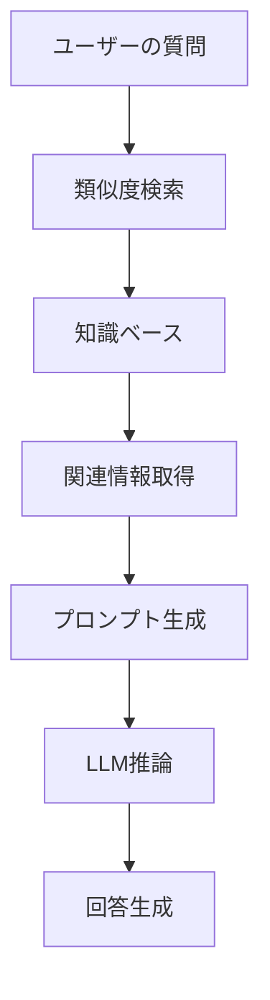

# 🍜 AIおばあちゃんの作り方 - 初心者でも10分で作れる！RAG搭載チャットボット物語

> 「孫よ、今日はおばあちゃんの秘密のレシピを教えてあげるわ。でも、これは料理のレシピじゃないの。AIのレシピよ。」

## 📖 目次

1. [プロローグ：AIおばあちゃんとの出会い](#プロローグ：AIおばあちゃんとの出会い)
2. [第1章：RAGって何？不思議な技術の正体](#第1章：RAGって何？不思議な技術の正体)
3. [第2章：材料を準備しよう - 開発環境構築](#第2章：材料を準備しよう---開発環境構築)
4. [第3章：知識の種をまく - 知識ベースの構築](#第3章：知識の種をまく---知識ベースの構築)
5. [第4章：記憶の魔法 - ベクトルストアの秘密](#第4章：記憶の魔法---ベクトルストアの秘密)
6. [第5章：会話の心臓 - APIサーバーの実装](#第5章：会話の心臓---APIサーバーの実装)
7. [第6章：美しい顔 - フロントエンドの作成](#第6章：美しい顔---フロントエンドの作成)
8. [第7章：魔法の完成 - 動作確認とカスタマイズ](#第7章：魔法の完成---動作確認とカスタマイズ)
9. [エピローグ：あなたの番です](#エピローグ：あなたの番です)

---

## プロローグ：AIおばあちゃんとの出会い

田中太郎（仮名）は、プログラミングを学び始めたばかりの大学生。「最近AIがすごいって聞くけど、自分でも作れるのかな？」と思っていた矢先、友人から不思議な話を聞いた。

「おばあちゃんの料理レシピを全部覚えてくれるAIがあるんだって！しかも、10分で作れるらしいよ」

興味津々の太郎は、その「AIおばあちゃん」のソースコードを見てみることにした。

```bash
git clone https://github.com/takusaotome/rag-starter-kit.git
cd rag-starter-kit
```

「これが、AIおばあちゃんの設計図...？」

---

## 第1章：RAGって何？不思議な技術の正体

### 🤖 AIおばあちゃんが教える「RAGの基本」

太郎がコードを眺めていると、突然画面の中からやさしい声が聞こえてきた。

「こんにちは、太郎くん。私がAIおばあちゃんよ。今日は、RAGという不思議な技術について教えてあげるわ。」

**RAG（Retrieval-Augmented Generation）**とは、日本語で「検索拡張生成」という意味。

### 🧠 普通のAIとRAG搭載AIの違い

**普通のAI（GPT-4など）**
```
質問: "親子丼の作り方教えて"
↓
AI: "一般的な親子丼の作り方は..."
```

**RAG搭載AI（AIおばあちゃん）**
```
質問: "親子丼の作り方教えて"
↓
① 知識ベースから関連情報を検索
② 見つけた情報 + 質問を組み合わせ
③ より正確で詳細な回答を生成
↓
AI: "おばあちゃんの秘伝レシピによると、親子丼の美味しさの秘密は..."
```

### 🔍 RAGの魔法の仕組み



「つまり、RAGはAIに『専門的な記憶』を持たせる技術なのよ。おばあちゃんの料理レシピを覚えさせれば、料理の専門家になれるの！」

---

## 第2章：材料を準備しよう - 開発環境構築

### 🛠️ 必要な材料（技術スタック）

AIおばあちゃんのレシピには、以下の材料が必要：

```python
# 🍳 調理器具（メインフレームワーク）
FastAPI      # 高速APIフレームワーク
LangChain    # AI開発フレームワーク
OpenAI       # 大規模言語モデル

# 🧠 記憶装置（ベクトルストア）
FAISS        # 高速類似度検索
OpenAI Embeddings  # テキストのベクトル化

# 🎨 その他の調味料
JWT          # 認証システム
Pydantic     # データ検証
Uvicorn      # ASGIサーバー
```

### 📦 環境構築の手順

```bash
# 1. 仮想環境を作成（料理で言う「清潔な調理場」）
python3 -m venv venv
source venv/bin/activate  # Windowsの場合: venv\Scripts\activate

# 2. 材料を調達（パッケージインストール）
pip install -r requirements.txt

# 3. 秘密の調味料を準備（API Key設定）
# .envファイルを作成
echo "OPENAI_API_KEY=your-api-key-here" > .env
echo "JWT_SECRET_KEY=your-secret-key" >> .env
```

**💡 初心者向けTips**

- **仮想環境って何？**: 料理で例えると「専用の調理場」。他のプロジェクトと材料が混ざらないように隔離する技術
- **API Keyって？**: OpenAIのサービスを使うための「入場券」。[OpenAI公式サイト](https://openai.com/)で取得可能

---

## 第3章：知識の種をまく - 知識ベースの構築

### 📚 おばあちゃんの知識ベース

太郎は`knowledge`フォルダを覗いてみた。

```bash
ls knowledge/
# 01_basic_rice_dishes.md
# 02_noodle_dishes.md
# 03_grilled_dishes.md
# ...
```

「わあ、本当におばあちゃんのレシピがいっぱい！」

### 🍜 知識ベースの中身を見てみよう

```markdown
# 基本のご飯もの - Basic Rice Dishes

## 親子丼 (Oyakodon - Chicken and Egg Rice Bowl)

### 由来・文化的背景
親子丼は明治時代に東京で生まれた料理で、
鶏肉（親）と卵（子）を使うことから「親子丼」と名付けられました。

### 材料（2人分）
- 鶏もも肉: 200g（一口大にカット）
- 卵: 4個
- 玉ねぎ: 1/2個（薄切り）
...

### 調理のコツ
- **卵は半熟が美味**: 完全に固めず、とろとろの半熟状態で仕上げる
- **火加減が重要**: 強火だと卵が固くなりすぎるので中火で調理
...
```

### 🔧 あなたの知識ベースを作る方法

**Step 1: 既存のファイルを参考にしよう**

```bash
# サンプルレシピを確認
cat knowledge/01_basic_rice_dishes.md
```

**Step 2: 自分の専門分野の知識を追加**

```markdown
# 例: プログラミング知識ベース
## Python基礎

### 変数の宣言
name = "太郎"
age = 20

### 関数の定義
def greet(name):
    return f"こんにちは、{name}さん！"
```

**Step 3: 構造化されたフォーマットを心がけよう**

```markdown
# 良い例
## 見出し
### 概要
### 詳細手順
### 注意点

# 悪い例
適当にテキストを羅列...
```

---

## 第4章：記憶の魔法 - ベクトルストアの秘密

### 🧠 AIの記憶の仕組み

「太郎くん、AIの記憶って人間とは違うのよ」とAIおばあちゃんが説明してくれた。

**人間の記憶**
- 文字として覚える
- 意味で思い出す
- 曖昧で感情的

**AIの記憶（ベクトルストア）**
- 数値の配列として覚える
- 数学的類似度で検索
- 正確で客観的

### 🔢 ベクトル化の魔法

```python
# 文章がベクトルに変換される様子
"親子丼の作り方" → [0.1, -0.3, 0.8, 0.2, ...]
"鶏肉と卵の料理" → [0.2, -0.2, 0.7, 0.3, ...]
```

類似度の計算：
```python
similarity = cosine_similarity(vector1, vector2)
# 0.85（とても似ている）
```

### 🏗️ ベクトルストアを構築しよう

```bash
# 知識ベースをベクトル化
python3 run_etl.py
```

実行すると、以下のような魔法が起こる：

```python
# ingest.py の中身（簡略版）
def process_documents():
    # 1. マークダウンファイルを読み込み
    documents = load_markdown_files("knowledge/")
    
    # 2. 文章を適切な長さに分割
    text_chunks = split_into_chunks(documents, chunk_size=800)
    
    # 3. 各チャンクをベクトルに変換
    embeddings = OpenAIEmbeddings()
    vectors = embeddings.embed_documents(text_chunks)
    
    # 4. 高速検索可能なインデックスを作成
    vector_store = FAISS.from_documents(text_chunks, embeddings)
    
    # 5. 保存
    vector_store.save_local("vector_store")
```

**💡 初心者向けTips**

- **チャンクって何？**: 長い文章を適切な長さに分割したもの。料理で言うと「一口大に切る」
- **なぜ分割するの？**: AIが理解しやすく、検索精度が向上する
- **ベクトルの次元数**: OpenAIの`text-embedding-3-small`は1536次元（1536個の数値）

---

## 第5章：会話の心臓 - APIサーバーの実装

### 🚀 FastAPIサーバーの構造

```python
# server.py の主要部分
from fastapi import FastAPI, HTTPException, Depends
from langchain.chains import RetrievalQA
from langchain_openai import ChatOpenAI

class RAGServer:
    def __init__(self):
        self.vector_store = None
        self.qa_chain = None
        self.embeddings = OpenAIEmbeddings()
    
    def process_query(self, query: str):
        # 1. 質問を受け取る
        # 2. 関連情報を検索
        # 3. LLMで回答生成
        # 4. 結果を返す
        pass
```

### 🔍 言語検出の魔法

おばあちゃんは多国語対応！

```python
def detect_language(self, text: str) -> str:
    """質問の言語を自動検出"""
    try:
        detected_lang = detect(text)
        if detected_lang == 'ja':
            return 'japanese'
        elif detected_lang == 'en':
            return 'english'
        else:
            return 'english'  # デフォルト
    except:
        return 'english'
```

### 🌊 ストリーミング機能

リアルタイムで回答が流れる仕組み：

```python
async def process_query_streaming(self, query: str):
    """ストリーミング形式で回答を生成"""
    # 言語検出
    language = self.detect_language(query)
    
    # 動的プロンプト生成
    prompt = self.get_dynamic_prompt_template(query)
    
    # ストリーミング開始
    async for chunk in self.streaming_qa_chain.astream({"query": query}):
        yield f"data: {json.dumps({'text': chunk.get('result', '')})}\n\n"
```

### 🔐 認証システム

```python
# JWT認証
def create_access_token(data: dict) -> str:
    to_encode = data.copy()
    expire = datetime.utcnow() + timedelta(hours=24)
    to_encode.update({"exp": expire})
    return jwt.encode(to_encode, Config.JWT_SECRET_KEY, algorithm="HS256")
```

---

## 第6章：美しい顔 - フロントエンドの作成

### 🎨 Tailwind CSSで美しいUI

```html
<!-- RAG_demo.html の抜粋 -->
<div class="min-h-screen bg-gradient-to-br from-blue-50 to-indigo-100">
    <div class="max-w-4xl mx-auto p-6">
        <div class="bg-white rounded-2xl shadow-xl overflow-hidden">
            <div class="bg-gradient-to-r from-indigo-500 to-purple-600 px-8 py-6">
                <h1 class="text-3xl font-bold text-white">
                    🍜 RAG Starter Kit Demo
                </h1>
            </div>
        </div>
    </div>
</div>
```

### ⌨️ キーボードショートカット

```javascript
// Cmd+Enter / Ctrl+Enter でクエリ実行
document.addEventListener('keydown', function(e) {
    if ((e.metaKey || e.ctrlKey) && e.key === 'Enter') {
        e.preventDefault();
        if (!submitButton.disabled) {
            submitQuery();
        }
    }
});
```

### 💫 リアルタイム応答表示

```javascript
// Server-Sent Events でストリーミング
const eventSource = new EventSource('/query/stream', {
    method: 'POST',
    headers: {
        'Authorization': `Bearer ${token}`,
        'Content-Type': 'application/json'
    }
});

eventSource.onmessage = function(event) {
    const data = JSON.parse(event.data);
    responseDiv.innerHTML += data.text;
};
```

---

## 第7章：魔法の完成 - 動作確認とカスタマイズ

### 🎯 AIおばあちゃんを起動してみよう

```bash
# 1. 依存関係のインストール
pip install -r requirements.txt

# 2. 環境変数設定
export OPENAI_API_KEY="your-api-key-here"

# 3. ベクトルストア構築
python3 run_etl.py

# 4. サーバー起動
python3 server.py
```

### 🌐 ブラウザでアクセス

```bash
# デモページを開く
open http://localhost:8000/RAG_demo.html
```

### 🍳 実際に質問してみよう

**日本語での質問**
```
質問: "親子丼の作り方を教えて"
回答: "おばあちゃんの秘伝レシピによると、親子丼の美味しさの秘密は..."
```

**英語での質問**
```
Question: "How to make Oyakodon?"
Answer: "According to the traditional recipe, the secret of delicious Oyakodon is..."
```

### 🎨 カスタマイズしてみよう

**1. 自分の知識ベースに変更**

```bash
# 既存のレシピを削除
rm knowledge/*.md

# 自分の知識を追加
echo "# My Knowledge Base" > knowledge/my_knowledge.md
```

**2. プロンプトのカスタマイズ**

```yaml
# prompt/prompt_japanese_cooking.yaml
name: "My AI Assistant"
description: "あなたの専門分野のAIアシスタント"
system_prompt: "あなたは[分野]の専門家です。"
```

**3. 外観のカスタマイズ**

```html
<!-- RAG_demo.html -->
<h1 class="text-3xl font-bold text-white">
    🤖 My AI Assistant
</h1>
```

---

## 第8章：実践的な活用例

### 💼 ビジネスでの活用

**1. 社内FAQ システム**
```markdown
# knowledge/company_faq.md
## 有給休暇の取得方法
### 申請手順
1. 社内システムにログイン
2. 休暇申請フォームを入力
...
```

**2. 製品マニュアル**
```markdown
# knowledge/product_manual.md
## 製品Aの使用方法
### 初期設定
1. 電源を入れる
2. 設定メニューを開く
...
```

### 🎓 教育での活用

**1. 学習支援システム**
```markdown
# knowledge/math_basics.md
## 二次方程式の解法
### 因数分解による解法
ax² + bx + c = 0 の形の方程式は...
```

**2. 言語学習アシスタント**
```markdown
# knowledge/english_phrases.md
## 日常会話フレーズ
### 挨拶
- Good morning = おはようございます
- How are you? = 調子はどう？
```

### 🏠 個人での活用

**1. 家計簿アシスタント**
```markdown
# knowledge/finance_tips.md
## 家計管理のコツ
### 支出の記録方法
1. レシートを写真で保存
2. カテゴリ別に分類
...
```

**2. 健康管理アシスタント**
```markdown
# knowledge/health_tips.md
## 運動習慣の作り方
### 初心者向けメニュー
- 週3回、30分のウォーキング
- 毎日5分のストレッチ
...
```

---

## 第9章：さらなる発展とベストプラクティス

### 🚀 パフォーマンス最適化

**1. チャンクサイズの調整**
```python
# config.py
CHUNK_SIZE = 1000  # 長い文書の場合
CHUNK_OVERLAP = 200  # 重複を増やして文脈を保持
```

**2. 検索結果数の調整**
```python
RETRIEVAL_K = 10  # より多くの関連情報を取得
```

**3. モデルの選択**
```python
LLM_MODEL = "gpt-3.5-turbo"  # コスト重視
LLM_MODEL = "gpt-4o"         # 品質重視
```

### 🔒 セキュリティ対策

**1. 環境変数の管理**
```bash
# .env ファイルは必ず .gitignore に追加
echo ".env" >> .gitignore
```

**2. 入力検証**
```python
class QueryRequest(BaseModel):
    query: str = Field(..., max_length=1000)
    user_id: str = Field(..., max_length=100)
```

**3. レート制限**
```python
from slowapi import Limiter
limiter = Limiter(key_func=get_remote_address)

@app.post("/query")
@limiter.limit("10/minute")
async def query_endpoint(request: Request, ...):
    pass
```

### 📊 監視とログ

**1. 構造化ログ**
```python
import logging
import json

logging.basicConfig(
    level=logging.INFO,
    format='%(asctime)s - %(name)s - %(levelname)s - %(message)s'
)

logger = logging.getLogger(__name__)

def log_query(query: str, response: str, user_id: str):
    logger.info(json.dumps({
        "event": "query_processed",
        "query": query,
        "response_length": len(response),
        "user_id": user_id,
        "timestamp": datetime.now().isoformat()
    }))
```

**2. メトリクス収集**
```python
from prometheus_client import Counter, Histogram

query_counter = Counter('rag_queries_total', 'Total queries processed')
response_time = Histogram('rag_response_time_seconds', 'Response time')

@response_time.time()
def process_query(query: str):
    query_counter.inc()
    # 処理...
```

---

## 第10章：トラブルシューティング

### 🐛 よくある問題と解決法

**1. ModuleNotFoundError**
```bash
# 解決法：仮想環境の確認
which python
pip list | grep langchain
```

**2. OpenAI API エラー**
```python
# 解決法：API制限の確認
import openai
try:
    response = openai.Completion.create(...)
except openai.error.RateLimitError:
    print("API制限に達しました")
```

**3. ベクトルストアの読み込みエラー**
```bash
# 解決法：再構築
rm -rf vector_store/
python3 run_etl.py
```

**4. ポート競合エラー**
```bash
# 解決法：ポート変更
export PORT=8080
python3 server.py
```

### 🔍 デバッグ方法

**1. ログレベルの変更**
```python
import logging
logging.basicConfig(level=logging.DEBUG)
```

**2. 検索結果の確認**
```python
def debug_retrieval(query: str):
    docs = vector_store.similarity_search(query, k=3)
    for i, doc in enumerate(docs):
        print(f"Document {i}: {doc.page_content[:100]}...")
```

**3. プロンプトの検証**
```python
def debug_prompt(query: str):
    prompt = get_dynamic_prompt_template(query)
    print(f"Generated prompt: {prompt}")
```

---

## エピローグ：あなたの番です

### 🎉 おめでとう！

太郎は、ついに自分だけの「AIおばあちゃん」を作ることができた。

「すごいじゃない、太郎くん！」AIおばあちゃんが微笑んだ。「これで、あなたも立派なRAGエンジニアね。」

### 🌟 次のステップ

**1. 自分だけの知識ベースを作る**
- 趣味の知識（音楽、スポーツ、ゲーム）
- 仕事の知識（業界情報、技術文書）
- 学習ノート（授業内容、参考書の要約）

**2. 機能を拡張する**
- 画像認識機能の追加
- 音声入力対応
- 多言語対応の強化
- スマートフォンアプリ化

**3. コミュニティに参加する**
- GitHub でコードを公開
- ブログで学習記録を発信
- 勉強会やハッカソンに参加

### 💝 最後に

RAGは、AIに「専門知識」を持たせる魔法の技術。でも、本当の魔法は、あなた自身の創造力とアイデア。

今日学んだことを活かして、世界をちょっと便利にする、あなただけのAIアシスタントを作ってみてください。

**「さあ、あなたの番よ。どんなAIアシスタントを作るの？」**

---

## 🔗 参考資料

### 📚 技術リファレンス

- **LangChain公式ドキュメント**: https://python.langchain.com/
- **FastAPI公式ドキュメント**: https://fastapi.tiangolo.com/
- **OpenAI API リファレンス**: https://platform.openai.com/docs
- **FAISS GitHub**: https://github.com/facebookresearch/faiss

### 🛠️ 開発ツール

- **Visual Studio Code**: https://code.visualstudio.com/
- **GitHub Desktop**: https://desktop.github.com/
- **Docker**: https://www.docker.com/
- **Postman**: https://www.postman.com/

### 🎓 学習リソース

- **機械学習 Coursera**: https://www.coursera.org/learn/machine-learning
- **Deep Learning Specialization**: https://www.coursera.org/specializations/deep-learning
- **Python.org チュートリアル**: https://docs.python.org/3/tutorial/

### 🌐 コミュニティ

- **Reddit - r/MachineLearning**: https://www.reddit.com/r/MachineLearning/
- **Stack Overflow**: https://stackoverflow.com/questions/tagged/langchain
- **Discord - AI/ML コミュニティ**: 各種サーバーに参加

---

## 🏷️ タグ

`#RAG` `#AI` `#ChatBot` `#Python` `#FastAPI` `#LangChain` `#OpenAI` `#初心者` `#チュートリアル` `#機械学習` `#自然言語処理` `#ベクトル検索` `#知識ベース` `#プログラミング学習`

---

*この記事が役に立ったら、ぜひ⭐をつけて、友達にもシェアしてください！*

**🚀 [RAG Starter Kit をGitHubで見る](https://github.com/takusaotome/rag-starter-kit)**

---

*最終更新日: 2024年1月*
*執筆者: AI と人間のコラボレーション*
*ライセンス: MIT License* 