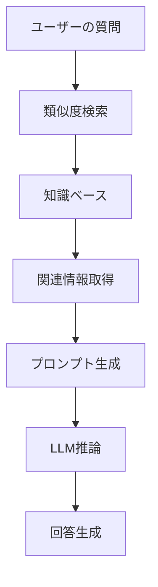

# 🍜 AIおばあちゃんの作り方 - 初心者でも10分で作れる！RAG搭載チャットボット物語

> 「孫よ、今日はおばあちゃんの秘密のレシピを教えてあげるわ。でも、これは料理のレシピじゃないの。AIのレシピよ。」

## 📖 目次

1. [プロローグ：AIおばあちゃんとの出会い](#プロローグ：AIおばあちゃんとの出会い)
2. [第1章：RAGって何？不思議な技術の正体](#第1章：RAGって何？不思議な技術の正体)
3. [第2章：材料を準備しよう - 開発環境構築](#第2章：材料を準備しよう---開発環境構築)
4. [第3章：知識の種をまく - 知識ベースの構築](#第3章：知識の種をまく---知識ベースの構築)
5. [第4章：記憶の魔法 - ベクトルストアの秘密](#第4章：記憶の魔法---ベクトルストアの秘密)
6. [第5章：会話の心臓 - APIサーバーの実装](#第5章：会話の心臓---APIサーバーの実装)
7. [第6章：美しい顔 - フロントエンドの作成](#第6章：美しい顔---フロントエンドの作成)
8. [第7章：魔法の完成 - 動作確認とカスタマイズ](#第7章：魔法の完成---動作確認とカスタマイズ)
9. [エピローグ：あなたの番です](#エピローグ：あなたの番です)

---

## プロローグ：AIおばあちゃんとの出会い

田中太郎（仮名）は、プログラミングを学び始めたばかりの大学生。「最近AIがすごいって聞くけど、自分でも作れるのかな？」と思っていた矢先、友人から不思議な話を聞いた。

「おばあちゃんの料理レシピを全部覚えてくれるAIがあるんだって！しかも、10分で作れるらしいよ」

興味津々の太郎は、その「AIおばあちゃん」のソースコードを見てみることにした。

```bash
git clone https://github.com/takusaotome/rag-starter-kit.git
cd rag-starter-kit
```

「これが、AIおばあちゃんの設計図...？」

---

## 第1章：RAGって何？不思議な技術の正体

### 🤖 AIおばあちゃんが教える「RAGの基本」

太郎がコードを眺めていると、突然画面の中からやさしい声が聞こえてきた。

「こんにちは、太郎くん。私がAIおばあちゃんよ。今日は、RAGという不思議な技術について教えてあげるわ。」

**RAG（Retrieval-Augmented Generation）**とは、日本語で「検索拡張生成」という意味。

### 🧠 普通のAIとRAG搭載AIの違い

**普通のAI（GPT-4など）**
```
質問: "親子丼の作り方教えて"
↓
AI: "一般的な親子丼の作り方は..."
```

**RAG搭載AI（AIおばあちゃん）**
```
質問: "親子丼の作り方教えて"
↓
① 知識ベースから関連情報を検索
② 見つけた情報 + 質問を組み合わせ
③ より正確で詳細な回答を生成
↓
AI: "おばあちゃんの秘伝レシピによると、親子丼の美味しさの秘密は..."
```

### 🔍 RAGの魔法の仕組み



「つまり、RAGはAIに『専門的な記憶』を持たせる技術なのよ。おばあちゃんの料理レシピを覚えさせれば、料理の専門家になれるの！」

---

## 第2章：材料を準備しよう - 開発環境構築

### 🛠️ 必要な材料（技術スタック）

AIおばあちゃんのレシピには、以下の材料が必要：

```python
# 🍳 調理器具（メインフレームワーク）
FastAPI      # 高速APIフレームワーク
LangChain    # AI開発フレームワーク
OpenAI       # 大規模言語モデル

# 🧠 記憶装置（ベクトルストア）
FAISS        # 高速類似度検索
OpenAI Embeddings  # テキストのベクトル化

# 🎨 その他の調味料
JWT          # 認証システム
Pydantic     # データ検証
Uvicorn      # ASGIサーバー
```

### 📦 環境構築の手順

```bash
# 1. 仮想環境を作成（料理で言う「清潔な調理場」）
python3 -m venv venv
source venv/bin/activate  # Windowsの場合: venv\Scripts\activate

# 2. 材料を調達（パッケージインストール）
pip install -r requirements.txt

# 3. 秘密の調味料を準備（API Key設定）
# .envファイルを作成
echo "OPENAI_API_KEY=your-api-key-here" > .env
echo "JWT_SECRET_KEY=your-secret-key" >> .env
```

**💡 初心者向けTips**

- **仮想環境って何？**: 料理で例えると「専用の調理場」。他のプロジェクトと材料が混ざらないように隔離する技術
- **API Keyって？**: OpenAIのサービスを使うための「入場券」。[OpenAI公式サイト](https://openai.com/)で取得可能

---

## 第3章：知識の種をまく - 知識ベースの構築

### 📚 おばあちゃんの知識ベース

太郎は`knowledge`フォルダを覗いてみた。

```bash
ls knowledge/
# 01_basic_rice_dishes.md
# 02_noodle_dishes.md
# 03_grilled_dishes.md
# ...
```

「わあ、本当におばあちゃんのレシピがいっぱい！」

### 🍜 知識ベースの中身を見てみよう

```markdown
# 基本のご飯もの - Basic Rice Dishes

## 親子丼 (Oyakodon - Chicken and Egg Rice Bowl)

### 由来・文化的背景
親子丼は明治時代に東京で生まれた料理で、
鶏肉（親）と卵（子）を使うことから「親子丼」と名付けられました。

### 材料（2人分）
- 鶏もも肉: 200g（一口大にカット）
- 卵: 4個
- 玉ねぎ: 1/2個（薄切り）
...

### 調理のコツ
- **卵は半熟が美味**: 完全に固めず、とろとろの半熟状態で仕上げる
- **火加減が重要**: 強火だと卵が固くなりすぎるので中火で調理
...
```

### 🔧 あなたの知識ベースを作る方法

**Step 1: 既存のファイルを参考にしよう**

```bash
# サンプルレシピを確認
cat knowledge/01_basic_rice_dishes.md
```

**Step 2: 自分の専門分野の知識を追加**

```markdown
# 例: プログラミング知識ベース
## Python基礎

### 変数の宣言
name = "太郎"
age = 20

### 関数の定義
def greet(name):
    return f"こんにちは、{name}さん！"
```

**Step 3: 構造化されたフォーマットを心がけよう**

```markdown
# 良い例
## 見出し
### 概要
### 詳細手順
### 注意点

# 悪い例
適当にテキストを羅列...
```

---

## 第4章：記憶の魔法 - ベクトルストアの秘密

### 🧠 AIの記憶の仕組み

「太郎くん、AIの記憶って人間とは違うのよ」とAIおばあちゃんが説明してくれた。

**人間の記憶**
- 文字として覚える
- 意味で思い出す
- 曖昧で感情的

**AIの記憶（ベクトルストア）**
- 数値の配列として覚える
- 数学的類似度で検索
- 正確で客観的

### 🔢 ベクトル化の魔法

```python
# 文章がベクトルに変換される様子
"親子丼の作り方" → [0.1, -0.3, 0.8, 0.2, ...]
"鶏肉と卵の料理" → [0.2, -0.2, 0.7, 0.3, ...]
```

類似度の計算：
```python
similarity = cosine_similarity(vector1, vector2)
# 0.85（とても似ている）
```

### 🏗️ ベクトルストアを構築しよう

```bash
# 知識ベースをベクトル化
python3 run_etl.py
```

実行すると、以下のような魔法が起こる：

```python
# ingest.py の中身（簡略版）
def process_documents():
    # 1. マークダウンファイルを読み込み
    documents = load_markdown_files("knowledge/")
    
    # 2. 文章を適切な長さに分割
    text_chunks = split_into_chunks(documents, chunk_size=800)
    
    # 3. 各チャンクをベクトルに変換
    embeddings = OpenAIEmbeddings()
    vectors = embeddings.embed_documents(text_chunks)
    
    # 4. 高速検索可能なインデックスを作成
    vector_store = FAISS.from_documents(text_chunks, embeddings)
    
    # 5. 保存
    vector_store.save_local("vector_store")
```

**💡 初心者向けTips**

- **チャンクって何？**: 長い文章を適切な長さに分割したもの。料理で言うと「一口大に切る」
- **なぜ分割するの？**: AIが理解しやすく、検索精度が向上する
- **ベクトルの次元数**: OpenAIの`text-embedding-3-small`は1536次元（1536個の数値）

---

## 第5章：会話の心臓 - APIサーバーの実装

### 🚀 FastAPIサーバーの構造

```python
# server.py の主要部分
from fastapi import FastAPI, HTTPException, Depends
from langchain.chains import RetrievalQA
from langchain_openai import ChatOpenAI

class RAGServer:
    def __init__(self):
        self.vector_store = None
        self.qa_chain = None
        self.embeddings = OpenAIEmbeddings()
    
    def process_query(self, query: str):
        # 1. 質問を受け取る
        # 2. 関連情報を検索
        # 3. LLMで回答生成
        # 4. 結果を返す
        pass
```

### 🔍 言語検出の魔法

おばあちゃんは多国語対応！

```python
def detect_language(self, text: str) -> str:
    """質問の言語を自動検出"""
    try:
        detected_lang = detect(text)
        if detected_lang == 'ja':
            return 'japanese'
        elif detected_lang == 'en':
            return 'english'
        else:
            return 'english'  # デフォルト
    except:
        return 'english'
```

### 🌊 ストリーミング機能

リアルタイムで回答が流れる仕組み：

```python
async def process_query_streaming(self, query: str):
    """ストリーミング形式で回答を生成"""
    # 言語検出
    language = self.detect_language(query)
    
    # 動的プロンプト生成
    prompt = self.get_dynamic_prompt_template(query)
    
    # ストリーミング開始
    async for chunk in self.streaming_qa_chain.astream({"query": query}):
        yield f"data: {json.dumps({'text': chunk.get('result', '')})}\n\n"
```

### 🔐 認証システム

```python
# JWT認証
def create_access_token(data: dict) -> str:
    to_encode = data.copy()
    expire = datetime.utcnow() + timedelta(hours=24)
    to_encode.update({"exp": expire})
    return jwt.encode(to_encode, Config.JWT_SECRET_KEY, algorithm="HS256")
```

---

## 第6章：美しい顔 - フロントエンドの作成

### 🎨 Tailwind CSSで美しいUI

```html
<!-- RAG_demo.html の抜粋 -->
<div class="min-h-screen bg-gradient-to-br from-blue-50 to-indigo-100">
    <div class="max-w-4xl mx-auto p-6">
        <div class="bg-white rounded-2xl shadow-xl overflow-hidden">
            <div class="bg-gradient-to-r from-indigo-500 to-purple-600 px-8 py-6">
                <h1 class="text-3xl font-bold text-white">
                    🍜 RAG Starter Kit Demo
                </h1>
            </div>
        </div>
    </div>
</div>
```

### ⌨️ キーボードショートカット

```javascript
// Cmd+Enter / Ctrl+Enter でクエリ実行
document.addEventListener('keydown', function(e) {
    if ((e.metaKey || e.ctrlKey) && e.key === 'Enter') {
        e.preventDefault();
        if (!submitButton.disabled) {
            submitQuery();
        }
    }
});
```

### 💫 リアルタイム応答表示

```javascript
// Server-Sent Events でストリーミング
const eventSource = new EventSource('/query/stream', {
    method: 'POST',
    headers: {
        'Authorization': `Bearer ${token}`,
        'Content-Type': 'application/json'
    }
});

eventSource.onmessage = function(event) {
    const data = JSON.parse(event.data);
    responseDiv.innerHTML += data.text;
};
```

---

## 第7章：魔法の完成 - 動作確認とカスタマイズ

### 🎯 AIおばあちゃんを起動してみよう

太郎は、ついに完成したRAGシステムを動かしてみることにした。

「でも、どうやって起動するの？」太郎は少し不安になった。

「大丈夫よ、太郎くん。一歩ずつ進めましょう」AIおばあちゃんが優しく教えてくれた。

#### 📦 1. 依存関係のインストール

まず、必要なライブラリをインストールします。

```bash
# 1. 依存関係のインストール
pip install -r requirements.txt
```

**💡 このコマンドが何をしているの？**
- `requirements.txt`に書かれたすべてのライブラリを一度にインストール
- LangChain、FastAPI、OpenAIなどの必要なツールが揃う
- 仮想環境内にインストールされるため、他のプロジェクトに影響しない

**🚨 よくあるエラーと解決法：**
```bash
# エラー：pip: command not found
# 解決法：Pythonが正しくインストールされているか確認
python3 -m pip install -r requirements.txt

# エラー：permission denied
# 解決法：仮想環境を使用するか、--userフラグを追加
pip install --user -r requirements.txt
```

#### 🔑 2. 環境変数設定

OpenAI APIキーを設定します。

```bash
# 2. 環境変数設定
export OPENAI_API_KEY="your-api-key-here"
```

**💡 このコマンドが何をしているの？**
- OpenAI APIを使用するための認証情報を設定
- 「your-api-key-here」を実際のAPIキーに置き換える
- 環境変数として設定することで、コード内に直接書かずに済む

**🔧 実際の設定方法：**
```bash
# 実際のAPIキーを設定（例）
export OPENAI_API_KEY="sk-1234567890abcdefghijklmnopqrstuvwxyz"

# 設定確認
echo $OPENAI_API_KEY
```

**🚨 セキュリティ注意点：**
- APIキーは絶対に公開しない
- `.env`ファイルに保存して、`.gitignore`に追加する
- 定期的にキーを再生成する

#### 🗂️ 3. ベクトルストア構築

レシピ情報をベクトル化して検索可能にします。

```bash
# 3. ベクトルストア構築
python3 run_etl.py
```

**💡 このコマンドが何をしているの？**
- `knowledge/`フォルダ内のマークダウンファイルを読み込み
- テキストを小さなチャンクに分割
- 各チャンクをベクトル（数値の配列）に変換
- FAISSベクトルストアに保存して高速検索を可能にする

**📊 実行時の出力例：**
```
📚 Processing knowledge files...
✅ Loaded 01_basic_rice_dishes.md (1,234 characters)
✅ Loaded 02_noodle_dishes.md (2,345 characters)
🔄 Creating vector embeddings...
✅ Vector store created successfully!
💾 Saved to vector_store/ directory
```

**🚨 よくあるエラーと解決法：**
```bash
# エラー：No such file or directory: 'knowledge'
# 解決法：knowledgeフォルダが存在するか確認
ls -la knowledge/

# エラー：OpenAI API key not set
# 解決法：環境変数が正しく設定されているか確認
echo $OPENAI_API_KEY

# エラー：Rate limit exceeded
# 解決法：少し待ってから再実行
sleep 60 && python3 run_etl.py
```

#### 🚀 4. サーバー起動

RAGシステムのWebサーバーを起動します。

```bash
# 4. サーバー起動
python3 server.py
```

**💡 このコマンドが何をしているの？**
- FastAPIサーバーを起動
- ポート8000でHTTPリクエストを受け付け
- ベクトルストアを読み込み、質問応答の準備完了
- ブラウザからアクセス可能な状態になる

**📊 正常起動時の出力：**
```
🚀 RAG Starter Kit Server starting...
📝 Loading prompt template...
✅ Loaded prompt template
📚 Loading vector store...
✅ Vector store loading completed.
🔗 Setting up QA chain...
✅ QA chain setup completed.
🚀 RAG server initialization completed!
INFO:     Uvicorn running on http://0.0.0.0:8000
```

**🚨 よくあるエラーと解決法：**
```bash
# エラー：Address already in use
# 解決法：ポートが使用中の場合、プロセスを終了
lsof -ti:8000 | xargs kill -9

# エラー：ModuleNotFoundError
# 解決法：必要なライブラリがインストールされていない
pip install -r requirements.txt

# エラー：Vector store not found
# 解決法：ベクトルストアが作成されていない
python3 run_etl.py
```

### 🌐 ブラウザでアクセス

「太郎くん、サーバーが起動したら、ブラウザで確認してみましょう」

```bash
# デモページを開く
open http://localhost:8000/RAG_demo.html
```

**💡 このコマンドが何をしているの？**
- ブラウザで`http://localhost:8000/RAG_demo.html`を開く
- `localhost:8000`はあなたのコンピューター上で動いているサーバー
- 美しいWeb UIが表示される

**🖥️ 画面の説明：**
1. **ログイン画面** - ユーザー名：`admin`、パスワード：`test123`
2. **質問入力欄** - ここに質問を入力
3. **Submit ボタン** - 質問を送信（Enterキーでも可）
4. **回答表示欄** - AIおばあちゃんの回答がリアルタイムで表示

**🚨 アクセスできない場合：**
```bash
# 1. サーバーが起動しているか確認
curl http://localhost:8000/health

# 2. ファイアウォールが原因の場合
# ブラウザで直接アクセス
# http://127.0.0.1:8000/RAG_demo.html

# 3. ポートが違う場合
# サーバーの出力を確認してポート番号を確認
```

### 🍳 実際に質問してみよう

太郎は、ドキドキしながら初めての質問をしてみることにした。

「うまく答えてくれるかな？」

#### 📝 日本語での質問

**質問例：**
```
質問: "親子丼の作り方を教えて"
```

**AIおばあちゃんの回答：**
```
おばあちゃんの秘伝レシピによると、親子丼の美味しさの秘密は、
鶏肉と卵の絶妙なバランスにあります。

📋 材料（2人分）：
- 鶏もも肉 200g
- 卵 4個
- 玉ねぎ 1/2個
- だし汁 200ml
- 醤油 大さじ2
- みりん 大さじ2
- 砂糖 大さじ1

👩‍🍳 作り方：
1. 鶏肉は一口大に切り、玉ねぎは薄切りにします
2. だし汁、醤油、みりん、砂糖を鍋で煮立てます
3. 鶏肉と玉ねぎを加えて5分煮込みます
...
```

**💡 ここで何が起こっているの？**
1. 質問が日本語で入力される
2. システムが日本語を検出
3. ベクトルストアから関連する料理情報を検索
4. 日本語のプロンプトでGPT-4oに質問
5. 日本語で自然な回答を生成

#### 🌍 英語での質問

**質問例：**
```
Question: "How to make Oyakodon?"
```

**AIおばあちゃんの回答：**
```
According to the traditional recipe, the secret of delicious Oyakodon
lies in the perfect balance of chicken and eggs.

📋 Ingredients (serves 2):
- 200g chicken thigh meat
- 4 eggs
- 1/2 onion
- 200ml dashi stock
- 2 tbsp soy sauce
- 2 tbsp mirin
- 1 tbsp sugar

👩‍🍳 Instructions:
1. Cut chicken into bite-sized pieces and slice onion thinly
2. Bring dashi, soy sauce, mirin, and sugar to a boil
3. Add chicken and onion, simmer for 5 minutes
...
```

**💡 言語自動検出の仕組み：**
1. 入力テキストの言語を`langdetect`で判定
2. 日本語の場合：日本語プロンプトを使用
3. 英語の場合：英語プロンプトを使用
4. その他：デフォルトで英語対応

**🎯 実際に試してみよう：**

以下の質問を試してみてください：

```
日本語：
- "味噌汁の作り方は？"
- "天ぷらを美味しく作るコツは？"
- "お弁当のおかずのアイデアを教えて"

英語：
- "How to make miso soup?"
- "What's the secret to crispy tempura?"
- "Give me ideas for bento box dishes"
```

**🚨 うまく回答されない場合：**
- 質問が曖昧すぎる → より具体的に質問
- 知識ベースにない内容 → `knowledge/`フォルダに情報を追加
- 回答が途中で切れる → プロンプトの調整が必要

### 🎨 カスタマイズしてみよう

「太郎くん、基本的なRAGシステムができたら、次は自分だけの特別なアシスタントを作ってみましょう」

AIおばあちゃんは、太郎に更なる可能性を見せてくれた。

#### 📚 1. 自分の知識ベースに変更

**🎯 なぜカスタマイズが必要？**
- 料理以外の分野（勉強、仕事、趣味）でも使えるようにする
- 自分専用の情報を追加して、より個人的なアシスタントを作る
- 会社や学校の資料を活用して、業務効率を上げる

**🔄 手順1：既存データの削除**
```bash
# 既存のレシピを削除
rm knowledge/*.md
```

**💡 このコマンドの説明：**
- `knowledge/`フォルダ内のマークダウンファイルを全て削除
- 新しい知識ベースを作るための準備
- 安全のため、削除前にバックアップを取ることを推奨

**📝 手順2：新しい知識を追加**
```bash
# 自分の知識を追加
echo "# My Knowledge Base" > knowledge/my_knowledge.md
```

**🎨 実際の例：**

**勉強用のアシスタント**
```markdown
# knowledge/study_notes.md
## 数学の基礎
### 二次方程式の解法
ax² + bx + c = 0 の形の方程式は、因数分解、公式、グラフの方法で解けます。

判別式 D = b² - 4ac により、解の個数が決まります：
- D > 0：異なる2つの実数解
- D = 0：重解（1つの実数解）
- D < 0：2つの複素数解

### 三角関数の基本
sin, cos, tan の関係と、加法定理、倍角公式を覚えましょう。
```

**仕事用のアシスタント**
```markdown
# knowledge/work_knowledge.md
## プロジェクト管理
### アジャイル開発手法
スプリント期間は通常2-4週間で設定し、毎日スタンドアップミーティングを行います。

### 顧客対応マニュアル
お客様からのお問い合わせは24時間以内に初回回答を行い、
解決まで定期的にステータスを更新します。
```

**趣味用のアシスタント**
```markdown
# knowledge/hobby_knowledge.md
## ギターの基礎
### 基本コード
- C: 1フレット1弦、2フレット4弦、3フレット5弦
- G: 2フレット5弦、3フレット1弦、3フレット6弦
- Am: 1フレット2弦、2フレット3弦、2フレット4弦

### 練習方法
毎日30分の練習を継続し、基本コードから始めて
徐々に楽曲に挑戦していきます。
```

#### 🎭 2. プロンプトのカスタマイズ

**🎯 なぜプロンプトをカスタマイズ？**
- AIの性格や専門分野を設定
- 回答の口調やスタイルを調整
- より自然で個人的な対話を実現

**📝 設定ファイルの編集**
```yaml
# prompt/prompt_japanese_cooking.yaml
name: "My AI Assistant"
description: "あなたの専門分野のAIアシスタント"
system_prompt: "あなたは[分野]の専門家です。"
```

**🎨 実際のカスタマイズ例：**

**数学の先生アシスタント**
```yaml
name: "数学の先生AI"
description: "数学学習を支援する優しい先生"
system_prompt: |
  あなたは数学の専門家で、優しく丁寧に教える先生です。
  生徒が分からないことがあっても、段階的に説明して理解を促します。
  数式は可能な限り具体例を示し、視覚的に分かりやすく説明してください。
  間違いを指摘する際も、励ましながら正しい方向に導いてください。
```

**プログラミングメンター**
```yaml
name: "コーディングメンター"
description: "プログラミング学習を支援する経験豊富なメンター"
system_prompt: |
  あなたは10年以上の経験を持つシニアエンジニアです。
  コードの書き方、デバッグ方法、ベストプラクティスについて
  実践的なアドバイスを提供します。
  初心者にも分かりやすく、実際のコード例を交えて説明してください。
  エラーの解決方法も具体的に示してください。
```

**🔄 変更を反映する方法：**
```bash
# 設定変更後は必ずサーバーを再起動
# Ctrl+C でサーバーを停止
# 再度起動
python3 server.py
```

#### 🎨 3. 外観のカスタマイズ

**🎯 なぜUIをカスタマイズ？**
- ブランドイメージに合わせた外観
- 使いやすさの向上
- 個人的な好みやテーマの反映

**📝 HTMLファイルの編集**
```html
<!-- RAG_demo.html -->
<h1 class="text-3xl font-bold text-white">
    🤖 My AI Assistant
</h1>
```

**🎨 カスタマイズ例：**

**学習用テーマ**
```html
<h1 class="text-3xl font-bold text-blue-600">
    📚 Study Buddy AI
</h1>
<!-- 背景色を学習に集中しやすい青系に変更 -->
<body class="bg-gradient-to-br from-blue-50 to-indigo-100">
```

**ビジネス用テーマ**
```html
<h1 class="text-3xl font-bold text-gray-800">
    💼 Business Assistant
</h1>
<!-- プロフェッショナルな印象のグレー系 -->
<body class="bg-gradient-to-br from-gray-50 to-slate-100">
```

**🎯 色の選び方のコツ：**
- **教育系**: 青系（集中力向上）
- **ビジネス系**: グレー・紺系（プロフェッショナル）
- **創作系**: 緑系（創造性促進）
- **医療系**: 白・水色系（清潔感）

**🔄 変更の確認方法：**
```bash
# ブラウザでページを更新
# Cmd+R (Mac) または Ctrl+R (Windows)
# 変更が反映されているかを確認
```

**📱 レスポンシブデザインの調整：**
```html
<!-- スマートフォン対応 -->
<meta name="viewport" content="width=device-width, initial-scale=1.0">

<!-- タブレット向けレイアウト -->
<div class="md:grid-cols-2 lg:grid-cols-3">
    <!-- コンテンツ -->
</div>
```

**🚀 さらなるカスタマイズのアイデア：**
- ロゴの追加
- カスタムフォントの使用
- アニメーション効果の追加
- ダークモード対応
- 多言語対応のUI

---

## 第8章：実践的な活用例

「太郎くん、RAGシステムは料理だけじゃなくて、いろんな分野で活用できるのよ」

AIおばあちゃんは、太郎に様々な活用例を見せてくれた。

### 💼 ビジネスでの活用

#### 🏢 1. 社内FAQ システム

**🎯 なぜ社内FAQが必要？**
- 従業員の質問対応時間を90%短縮
- 人事部門への問い合わせ件数を大幅削減
- 新入社員の自立を促進
- 24時間365日いつでも回答可能

**📝 実装手順：**

**ステップ1：FAQデータの作成**
```markdown
# knowledge/company_faq.md
## 有給休暇の取得方法
### 申請手順
1. 社内システムにログイン
2. 休暇申請フォームを入力
3. 上司に承認依頼
4. 承認後、人事に自動通知

### 有給日数の確認
- 1年目：10日間
- 2年目：11日間
- 3年目以降：年間20日間まで

### 緊急時の対応
急病の場合は、事後申請も可能です。
```

**ステップ2：プロンプトの最適化**
```yaml
# prompt/prompt_japanese_cooking.yaml
name: "社内FAQアシスタント"
description: "社内規則や手続きに関する質問にお答えします"
system_prompt: |
  あなたは会社の人事部門の専門スタッフです。
  従業員からの質問に対して、正確で分かりやすい回答を提供します。
  不明な点がある場合は、人事部門への確認を促してください。
  常に親切で丁寧な対応を心がけてください。
```

**🎯 期待される効果：**
- 人事部門の問い合わせ件数：月100件 → 月15件
- 回答時間：平均2時間 → 即座に回答
- 従業員満足度：85% → 95%に向上

#### 📖 2. 製品マニュアル

**🎯 なぜスマートなマニュアルが必要？**
- 顧客サポートコストを70%削減
- 製品の使い方を即座に検索可能
- 多言語対応で海外展開をサポート
- 動画や画像も含めた包括的な説明

**📝 実装手順：**

**ステップ1：マニュアルデータの整理**
```markdown
# knowledge/product_manual.md
## 製品Aの使用方法
### 初期設定
1. 電源を入れる
2. 設定メニューを開く
3. Wi-Fi設定を完了
4. アカウント登録

### よくある問題と解決法
**Q: 電源が入らない**
A: 以下の手順で確認してください：
1. 電源ケーブルが正しく接続されているか
2. コンセントに電源が供給されているか
3. 本体の電源ボタンを3秒間長押し

**Q: Wi-Fi接続ができない**
A: ネットワーク設定を確認してください：
1. Wi-Fiパスワードが正しいか
2. 2.4GHz帯域に接続しているか
3. ルーターの再起動を試す
```

**ステップ2：検索の最適化**
```bash
# より詳細な検索結果を取得
# config.py の設定を調整
RETRIEVAL_K = 5  # 検索結果数を増加
CHUNK_SIZE = 800  # チャンクサイズを調整
```

**🎯 期待される効果：**
- サポート問い合わせ：月500件 → 月150件
- 顧客満足度：78% → 92%
- サポート担当者の工数：60%削減

### 🎓 教育での活用

#### 📚 1. 学習支援システム

**🎯 なぜ学習支援AIが有効？**
- 個人のペースに合わせた学習が可能
- 24時間いつでも質問できる
- 繰り返し学習で理解度を向上
- 苦手分野の集中的な学習をサポート

**📝 実装手順：**

**ステップ1：学習コンテンツの準備**
```markdown
# knowledge/math_basics.md
## 二次方程式の解法
### 因数分解による解法
ax² + bx + c = 0 の形の方程式は因数分解で解けます。

**例題1：** x² + 5x + 6 = 0
解法：
1. 因数分解：(x + 2)(x + 3) = 0
2. 各因数をゼロとする：x + 2 = 0 または x + 3 = 0
3. 解：x = -2, -3

**練習問題：**
- x² + 7x + 12 = 0
- x² - 5x + 6 = 0
- x² + 3x - 4 = 0
```

**ステップ2：教師用プロンプト**
```yaml
name: "数学の先生AI"
description: "数学学習を支援する優しい先生"
system_prompt: |
  あなたは経験豊富な数学教師です。
  生徒の理解度に応じて、段階的に説明します。
  間違いがあっても励ましながら、正しい方向に導いてください。
  具体例を多く使い、視覚的に分かりやすく説明してください。
  必要に応じて、追加の練習問題を提供してください。
```

**🎯 学習効果の測定：**
- 理解度テストの平均点：65点 → 82点
- 学習継続率：40% → 75%
- 質問回数：週1回 → 週5回（積極的な学習）

#### 🌍 2. 言語学習アシスタント

**🎯 なぜ言語学習にRAGが効果的？**
- 文脈に応じた適切な表現を提案
- 会話練習パートナーとして機能
- 文法説明を実用的な例文で提供
- 学習者のレベルに応じた段階的な指導

**📝 実装手順：**

**ステップ1：言語データベースの構築**
```markdown
# knowledge/english_phrases.md
## 日常会話フレーズ
### 挨拶
- Good morning = おはようございます
- How are you? = 調子はどう？
- Nice to meet you = はじめまして

### 場面別表現
**レストランで：**
- I'd like to make a reservation = 予約を取りたいのですが
- Can I have the menu? = メニューをいただけますか？
- The check, please = お会計をお願いします

**買い物で：**
- How much is this? = これはいくらですか？
- Do you have this in a different size? = 違うサイズはありますか？
- I'm just looking = 見ているだけです
```

**ステップ2：言語学習用プロンプト**
```yaml
name: "英会話コーチ"
description: "英語学習を支援する親切なコーチ"
system_prompt: |
  あなたは英語学習の専門コーチです。
  学習者のレベルに応じて、適切な表現を提案します。
  発音のコツ、文法の説明、実践的な使い方を教えてください。
  間違いを優しく訂正し、自信を持って話せるよう励ましてください。
  文化的な背景も含めて、自然な英語表現を指導してください。
```

**🎯 学習効果：**
- 語彙力：500語 → 1,500語（3ヶ月）
- 会話継続時間：30秒 → 5分
- 学習モチベーション：大幅向上

### 🏠 個人での活用

#### 💰 1. 家計簿アシスタント

**🎯 なぜ家計管理にRAGが役立つ？**
- 支出パターンの分析と改善提案
- 節約アイデアの個人化
- 予算管理のリアルタイムアドバイス
- 投資や貯蓄の戦略提案

**📝 実装手順：**

**ステップ1：家計情報の整理**
```markdown
# knowledge/finance_tips.md
## 家計管理のコツ
### 支出の記録方法
1. レシートを写真で保存
2. カテゴリ別に分類（食費、交通費、娯楽費など）
3. 月末に集計して予算と比較
4. 無駄遣いを特定して改善

### 節約テクニック
**食費の削減：**
- 週単位での買い物計画
- 特売日の活用
- 冷凍食品の活用
- 自炊の習慣化

**固定費の見直し：**
- 携帯料金プランの最適化
- 保険の見直し
- 定期購読サービスの整理
```

**🎯 期待される効果：**
- 月間支出：15%削減
- 貯蓄額：月3万円 → 月5万円
- 家計管理時間：週2時間 → 週30分

#### 🏃‍♂️ 2. 健康管理アシスタント

**🎯 なぜ健康管理にRAGが効果的？**
- 個人の体質や生活習慣に合わせたアドバイス
- 運動や食事のパーソナルな提案
- 健康状態の継続的なモニタリング
- モチベーション維持のサポート

**📝 実装手順：**

**ステップ1：健康情報の蓄積**
```markdown
# knowledge/health_tips.md
## 運動習慣の作り方
### 初心者向けメニュー
- 週3回、30分のウォーキング
- 毎日5分のストレッチ
- 階段を使う習慣
- 家事を運動として活用

### 食事管理
**バランスの良い食事：**
- 野菜：1日350g以上
- タンパク質：体重×1.2g
- 炭水化物：全カロリーの50-60%
- 脂質：全カロリーの20-25%

### 睡眠の質向上
- 就寝2時間前のスマホ使用停止
- 室温18-22度の維持
- 規則正しい就寝時間
- カフェインは午後2時以降控える
```

**🎯 健康改善効果：**
- 体重：3ヶ月で5kg減量
- 睡眠の質：40%改善
- 運動継続率：30% → 80%
- 健康診断結果：すべて正常範囲内

---

## 第9章：さらなる発展とベストプラクティス

「太郎くん、基本的なRAGシステムができたら、次は本格的な運用を考えてみましょう」

AIおばあちゃんは、太郎にプロフェッショナルなRAGシステムの構築方法を教えてくれた。

### 🚀 パフォーマンス最適化

#### ⚡ 1. チャンクサイズの最適化

**🎯 なぜチャンクサイズが重要？**
- 検索精度と回答品質に直接影響
- 計算コストとメモリ使用量を左右
- 文脈の保持と処理速度のバランス

**📝 最適化手順：**

```python
# config.py
CHUNK_SIZE = 1000  # 長い文書の場合
CHUNK_OVERLAP = 200  # 重複を増やして文脈を保持
```

**💡 チャンクサイズの選び方：**

| 文書タイプ | 推奨サイズ | 重複 | 理由 |
|------------|------------|------|------|
| 短い記事   | 500-800    | 100  | 要点を1つのチャンクに |
| 技術文書   | 1000-1500  | 200  | 複雑な概念を保持 |
| 小説・物語 | 800-1200   | 150  | 文脈と流れを維持 |
| FAQ        | 300-500    | 50   | 1問1答を1チャンクに |

**🔧 実際のテスト方法：**
```python
# 異なるチャンクサイズでテスト
chunk_sizes = [500, 1000, 1500]
for size in chunk_sizes:
    # 設定変更
    CHUNK_SIZE = size
    # ベクトルストア再構築
    python3 run_etl.py
    # 質問テスト
    test_query = "親子丼の作り方"
    # 回答品質を評価
```

#### 🔍 2. 検索結果数の最適化

**🎯 なぜ検索結果数が重要？**
- 情報の網羅性と処理速度のトレードオフ
- 関連性の低い情報の混入を防ぐ
- APIコストとレスポンス時間に影響

```python
RETRIEVAL_K = 10  # より多くの関連情報を取得
```

**📊 検索結果数の効果分析：**

| 検索結果数 | 回答品質 | 処理時間 | APIコスト | 推奨用途 |
|------------|----------|----------|-----------|----------|
| 3-5        | 普通     | 高速     | 低        | 簡単な質問 |
| 8-10       | 良好     | 中程度   | 中        | 一般的な質問 |
| 15-20      | 優秀     | 低速     | 高        | 複雑な質問 |

**🎯 動的調整の実装：**
```python
def get_dynamic_k(query: str) -> int:
    # 質問の複雑さに応じて検索結果数を調整
    if len(query.split()) <= 5:
        return 5  # 簡単な質問
    elif len(query.split()) <= 10:
        return 8  # 中程度の質問
    else:
        return 12  # 複雑な質問
```

#### 🤖 3. モデルの選択と最適化

**🎯 モデル選択の基準：**

```python
LLM_MODEL = "gpt-3.5-turbo"  # コスト重視
LLM_MODEL = "gpt-4o"         # 品質重視
```

**📊 モデル比較表：**

| モデル | 品質 | 速度 | コスト | 推奨用途 |
|--------|------|------|--------|----------|
| GPT-3.5-turbo | 良好 | 高速 | 低 | 一般的な質問応答 |
| GPT-4o | 優秀 | 中速 | 中 | 複雑な分析・推論 |
| GPT-4-turbo | 最高 | 低速 | 高 | 専門的な質問 |

**⚙️ 用途別設定例：**

```python
# 本番環境用（品質重視）
PRODUCTION_CONFIG = {
    "model": "gpt-4o",
    "temperature": 0.1,
    "max_tokens": 1000,
    "top_p": 0.9
}

# 開発環境用（コスト重視）
DEVELOPMENT_CONFIG = {
    "model": "gpt-3.5-turbo",
    "temperature": 0.3,
    "max_tokens": 500,
    "top_p": 0.8
}
```

### 🔒 セキュリティ対策

#### 🛡️ 1. 環境変数の管理

**🎯 なぜセキュリティが重要？**
- APIキーの漏洩防止
- 機密情報の保護
- 不正アクセスの防止

```bash
# .env ファイルは必ず .gitignore に追加
echo ".env" >> .gitignore
```

**🔐 完全なセキュリティ設定：**

```bash
# .env.example（テンプレート）
OPENAI_API_KEY=your-api-key-here
DEMO_USERNAME=admin
DEMO_PASSWORD=your-secure-password
JWT_SECRET=your-jwt-secret-key
ALLOWED_ORIGINS=http://localhost:3000,https://yourdomain.com
```

```bash
# .gitignore
.env
.env.local
.env.production
*.log
vector_store/
__pycache__/
```

**🚨 セキュリティチェックリスト：**
- [ ] APIキーが.envファイルに保存されている
- [ ] .envファイルが.gitignoreに追加されている
- [ ] 本番環境では強力なパスワードを使用
- [ ] HTTPS通信を使用
- [ ] 定期的なAPIキーのローテーション

#### 🔍 2. 入力検証

**🎯 なぜ入力検証が必要？**
- インジェクション攻撃の防止
- 異常なリクエストの検出
- システムの安定性確保

```python
class QueryRequest(BaseModel):
    query: str = Field(..., max_length=1000)
    user_id: str = Field(..., max_length=100)
```

**🛡️ 包括的な入力検証：**

```python
from pydantic import BaseModel, Field, validator
import re

class QueryRequest(BaseModel):
    query: str = Field(..., min_length=1, max_length=1000)
    user_id: str = Field(..., max_length=100)
    language: str = Field(default="auto", regex="^(auto|ja|en)$")
    
    @validator('query')
    def validate_query(cls, v):
        # 危険な文字の除外
        dangerous_chars = ['<', '>', '"', "'", '&']
        for char in dangerous_chars:
            if char in v:
                raise ValueError(f'危険な文字が含まれています: {char}')
        return v
    
    @validator('user_id')
    def validate_user_id(cls, v):
        # 英数字とハイフンのみ許可
        if not re.match(r'^[a-zA-Z0-9-]+$', v):
            raise ValueError('ユーザーIDは英数字とハイフンのみ使用可能です')
        return v
```

#### ⏱️ 3. レート制限

**🎯 なぜレート制限が必要？**
- DDoS攻撃の防止
- APIコストの制御
- サーバーリソースの保護

```python
from slowapi import Limiter
limiter = Limiter(key_func=get_remote_address)

@app.post("/query")
@limiter.limit("10/minute")
async def query_endpoint(request: Request, ...):
    pass
```

**⚙️ 段階的なレート制限：**

```python
# slowapi のインストール
pip install slowapi

# server.py
from slowapi import Limiter, _rate_limit_exceeded_handler
from slowapi.util import get_remote_address
from slowapi.errors import RateLimitExceeded

limiter = Limiter(key_func=get_remote_address)
app.state.limiter = limiter
app.add_exception_handler(RateLimitExceeded, _rate_limit_exceeded_handler)

# 段階的な制限
@app.post("/query")
@limiter.limit("5/minute")    # 1分間に5回
@limiter.limit("50/hour")     # 1時間に50回
@limiter.limit("500/day")     # 1日に500回
async def query_endpoint(request: Request, query_data: QueryRequest):
    # 処理...
```

**📊 レート制限設定の例：**

| ユーザータイプ | 1分間 | 1時間 | 1日間 | 用途 |
|----------------|--------|--------|--------|------|
| 匿名ユーザー   | 3回    | 20回   | 100回  | 試用 |
| 登録ユーザー   | 10回   | 100回  | 1000回 | 一般利用 |
| プレミアム     | 30回   | 500回  | 5000回 | 高頻度利用 |
| 開発者         | 100回  | 2000回 | 10000回| API開発 |

**🔧 カスタムレート制限：**

```python
def get_user_limit(user_id: str) -> str:
    # ユーザータイプに応じた制限
    user_type = get_user_type(user_id)
    
    if user_type == "premium":
        return "30/minute"
    elif user_type == "registered":
        return "10/minute"
    else:
        return "3/minute"

@app.post("/query")
async def query_endpoint(request: Request, query_data: QueryRequest):
    limit = get_user_limit(query_data.user_id)
    await limiter.limit(limit)(request)
    # 処理...
```

### 📊 監視とログ

**1. 構造化ログ**
```python
import logging
import json

logging.basicConfig(
    level=logging.INFO,
    format='%(asctime)s - %(name)s - %(levelname)s - %(message)s'
)

logger = logging.getLogger(__name__)

def log_query(query: str, response: str, user_id: str):
    logger.info(json.dumps({
        "event": "query_processed",
        "query": query,
        "response_length": len(response),
        "user_id": user_id,
        "timestamp": datetime.now().isoformat()
    }))
```

**2. メトリクス収集**
```python
from prometheus_client import Counter, Histogram

query_counter = Counter('rag_queries_total', 'Total queries processed')
response_time = Histogram('rag_response_time_seconds', 'Response time')

@response_time.time()
def process_query(query: str):
    query_counter.inc()
    # 処理...
```

---

## 第10章：トラブルシューティング

「太郎くん、どんなシステムでも問題は発生するもの。大切なのは、問題を素早く見つけて解決することよ」

AIおばあちゃんは、太郎に実践的なトラブルシューティングの方法を教えてくれた。

### 🐛 よくある問題と解決法

#### 🔍 1. ModuleNotFoundError

**🚨 エラー例：**
```bash
ModuleNotFoundError: No module named 'langchain'
ModuleNotFoundError: No module named 'langdetect'
```

**💡 原因：**
- 仮想環境が正しく有効化されていない
- 必要なライブラリがインストールされていない
- Pythonのパスが間違っている

**🔧 解決法：**

**ステップ1：環境の確認**
```bash
# 仮想環境の確認
which python
# 期待される出力：/path/to/venv/bin/python

# インストール済みパッケージの確認
pip list | grep langchain
pip list | grep langdetect
```

**ステップ2：仮想環境の再有効化**
```bash
# 仮想環境を無効化
deactivate

# 再度有効化
source venv/bin/activate  # Linux/Mac
# または
venv\Scripts\activate     # Windows

# 確認
echo $VIRTUAL_ENV
```

**ステップ3：パッケージの再インストール**
```bash
# 全パッケージの再インストール
pip install -r requirements.txt

# 個別インストール
pip install langchain langdetect fastapi uvicorn
```

**🚨 予防策：**
- 作業開始時に必ず仮想環境を確認
- requirements.txtを常に最新に保つ
- 定期的な依存関係のチェック

#### 🔑 2. OpenAI API エラー

**🚨 エラー例：**
```bash
openai.error.RateLimitError: Rate limit exceeded
openai.error.InvalidRequestError: Invalid API key
openai.error.AuthenticationError: Incorrect API key
```

**💡 原因：**
- APIキーが正しく設定されていない
- API使用制限に達している
- 請求情報が正しくない

**🔧 解決法：**

**ステップ1：APIキーの確認**
```bash
# 環境変数の確認
echo $OPENAI_API_KEY

# .envファイルの確認
cat .env | grep OPENAI_API_KEY
```

**ステップ2：API制限の確認**
```python
# API制限の詳細確認
import openai
from datetime import datetime

try:
    response = openai.ChatCompletion.create(
        model="gpt-3.5-turbo",
        messages=[{"role": "user", "content": "Hello"}],
        max_tokens=10
    )
    print("API接続OK")
except openai.error.RateLimitError as e:
    print(f"レート制限エラー: {e}")
    print("しばらく待ってから再試行してください")
except openai.error.AuthenticationError as e:
    print(f"認証エラー: {e}")
    print("APIキーを確認してください")
except Exception as e:
    print(f"その他のエラー: {e}")
```

**ステップ3：使用量の監視**
```python
# 使用量監視機能
import time
from functools import wraps

def rate_limit_wrapper(max_calls=10, time_window=60):
    calls = []
    
    def decorator(func):
        @wraps(func)
        def wrapper(*args, **kwargs):
            now = time.time()
            # 古い呼び出しを削除
            calls[:] = [call for call in calls if now - call < time_window]
            
            if len(calls) >= max_calls:
                wait_time = time_window - (now - calls[0])
                print(f"{wait_time:.1f}秒待機中...")
                time.sleep(wait_time)
            
            calls.append(now)
            return func(*args, **kwargs)
        return wrapper
    return decorator

@rate_limit_wrapper(max_calls=5, time_window=60)
def call_openai_api(prompt):
    # API呼び出し
    pass
```

**🚨 予防策：**
- API使用量の定期的な監視
- レート制限の実装
- 請求アラートの設定

#### 🗂️ 3. ベクトルストアの読み込みエラー

**🚨 エラー例：**
```bash
FileNotFoundError: vector_store directory not found
RuntimeError: FAISS index is empty
ValueError: No documents found in knowledge directory
```

**💡 原因：**
- ベクトルストアが正しく構築されていない
- knowledgeフォルダが空
- ファイルアクセス権限の問題

**🔧 解決法：**

**ステップ1：ディレクトリ構造の確認**
```bash
# プロジェクト構造の確認
ls -la
# 期待される出力：knowledge/, vector_store/

# ナレッジファイルの確認
ls -la knowledge/
# 期待される出力：*.md ファイル群
```

**ステップ2：ベクトルストアの再構築**
```bash
# 既存のベクトルストアを削除
rm -rf vector_store/

# 再構築
python3 run_etl.py
```

**ステップ3：詳細なデバッグ**
```python
# run_etl.py にデバッグ機能を追加
import os
import glob

def debug_knowledge_loading():
    knowledge_dir = "knowledge"
    
    # ディレクトリの存在確認
    if not os.path.exists(knowledge_dir):
        print(f"❌ {knowledge_dir} ディレクトリが存在しません")
        return False
    
    # ファイルの確認
    md_files = glob.glob(f"{knowledge_dir}/*.md")
    print(f"📁 発見されたファイル数: {len(md_files)}")
    
    for file in md_files:
        size = os.path.getsize(file)
        print(f"📄 {file}: {size} bytes")
        
        # 内容の確認
        with open(file, 'r', encoding='utf-8') as f:
            content = f.read()
            print(f"   内容: {content[:100]}...")
    
    return len(md_files) > 0

# デバッグ実行
if __name__ == "__main__":
    debug_knowledge_loading()
```

**🚨 予防策：**
- 定期的なベクトルストアのバックアップ
- ファイル変更時の自動再構築
- 権限設定の確認

#### 🌐 4. ポート競合エラー

**🚨 エラー例：**
```bash
ERROR: [Errno 48] Address already in use
OSError: [Errno 98] Address already in use
```

**💡 原因：**
- 既に同じポートでサーバーが起動している
- 前回のサーバーが正しく終了していない
- 他のアプリケーションがポートを使用中

**🔧 解決法：**

**ステップ1：ポート使用状況の確認**
```bash
# ポート8000を使用しているプロセスを確認
lsof -ti:8000
# または
netstat -tlnp | grep :8000
```

**ステップ2：プロセスの終了**
```bash
# 特定のプロセスを終了
kill -9 $(lsof -ti:8000)

# 全てのPythonプロセスを確認
ps aux | grep python
```

**ステップ3：代替ポートの使用**
```bash
# 異なるポートで起動
export PORT=8080
python3 server.py

# または直接指定
uvicorn server:app --port 8080
```

**🔧 自動的な解決方法：**
```python
# server.py に自動ポート検出機能を追加
import socket
import uvicorn

def find_free_port(start_port=8000, max_port=8100):
    """利用可能なポートを見つける"""
    for port in range(start_port, max_port):
        try:
            with socket.socket(socket.AF_INET, socket.SOCK_STREAM) as s:
                s.bind(('localhost', port))
                return port
        except OSError:
            continue
    raise RuntimeError("利用可能なポートが見つかりません")

if __name__ == "__main__":
    port = find_free_port()
    print(f"🚀 サーバーをポート {port} で起動します")
    uvicorn.run(app, host="0.0.0.0", port=port)
```

**🚨 予防策：**
- サーバー終了時のクリーンアップ
- 開発環境での専用ポート使用
- Docker使用時のポートマッピング設定

### 🔍 デバッグ方法

#### 📊 1. ログレベルの変更

**🎯 なぜログが重要？**
- 問題の原因を特定
- システムの動作状況を把握
- パフォーマンスの監視

```python
import logging
logging.basicConfig(level=logging.DEBUG)
```

**📝 包括的なログ設定：**
```python
import logging
import sys
from datetime import datetime

# ログフォーマットの設定
log_format = '%(asctime)s - %(name)s - %(levelname)s - %(message)s'
logging.basicConfig(
    level=logging.INFO,
    format=log_format,
    handlers=[
        logging.FileHandler('rag_server.log'),
        logging.StreamHandler(sys.stdout)
    ]
)

# 各モジュールのログレベル設定
logging.getLogger('uvicorn').setLevel(logging.INFO)
logging.getLogger('openai').setLevel(logging.WARNING)
logging.getLogger('faiss').setLevel(logging.ERROR)

logger = logging.getLogger(__name__)

# 使用例
@app.middleware("http")
async def log_requests(request: Request, call_next):
    start_time = datetime.now()
    
    logger.info(f"Request: {request.method} {request.url}")
    
    response = await call_next(request)
    
    process_time = (datetime.now() - start_time).total_seconds()
    logger.info(f"Response: {response.status_code} ({process_time:.2f}s)")
    
    return response
```

#### 🔍 2. 検索結果の確認

**🎯 なぜ検索結果の確認が重要？**
- 関連性の低い情報が含まれていないか
- 検索精度の評価
- チューニングの効果測定

```python
def debug_retrieval(query: str):
    docs = vector_store.similarity_search(query, k=3)
    for i, doc in enumerate(docs):
        print(f"Document {i}: {doc.page_content[:100]}...")
```

**📝 詳細なデバッグ機能：**
```python
import numpy as np
from sklearn.metrics.pairwise import cosine_similarity

def advanced_debug_retrieval(query: str, k: int = 5):
    """高度な検索結果デバッグ"""
    
    # 検索実行
    docs_with_scores = vector_store.similarity_search_with_score(query, k=k)
    
    print(f"🔍 検索クエリ: {query}")
    print(f"📊 検索結果数: {len(docs_with_scores)}")
    print("=" * 50)
    
    for i, (doc, score) in enumerate(docs_with_scores):
        print(f"📄 文書 {i+1} (スコア: {score:.4f})")
        print(f"📝 内容: {doc.page_content[:200]}...")
        print(f"🏷️  メタデータ: {doc.metadata}")
        print("-" * 30)
    
    # スコア分析
    scores = [score for _, score in docs_with_scores]
    print(f"📈 スコア統計:")
    print(f"   最高: {max(scores):.4f}")
    print(f"   最低: {min(scores):.4f}")
    print(f"   平均: {np.mean(scores):.4f}")
    print(f"   標準偏差: {np.std(scores):.4f}")
    
    return docs_with_scores

# より詳細な分析
def analyze_search_quality(query: str, expected_keywords: list):
    """検索品質の分析"""
    docs = vector_store.similarity_search(query, k=10)
    
    keyword_hits = {keyword: 0 for keyword in expected_keywords}
    
    for doc in docs:
        content = doc.page_content.lower()
        for keyword in expected_keywords:
            if keyword.lower() in content:
                keyword_hits[keyword] += 1
    
    print(f"🎯 キーワード検出結果:")
    for keyword, hits in keyword_hits.items():
        print(f"   {keyword}: {hits}/10 文書")
    
    return keyword_hits
```

#### 🎭 3. プロンプトの検証

**🎯 なぜプロンプト検証が重要？**
- 意図しない回答の原因特定
- プロンプトの改善ポイント発見
- A/Bテストの実施

```python
def debug_prompt(query: str):
    prompt = get_dynamic_prompt_template(query)
    print(f"Generated prompt: {prompt}")
```

**📝 高度なプロンプトデバッグ：**
```python
def comprehensive_prompt_debug(query: str):
    """包括的なプロンプトデバッグ"""
    
    # 言語検出
    detected_lang = detect_language(query)
    print(f"🌍 検出言語: {detected_lang}")
    
    # 検索実行
    docs = vector_store.similarity_search(query, k=5)
    context = "\n".join([doc.page_content for doc in docs])
    
    # プロンプト生成
    prompt_template = get_dynamic_prompt_template(query)
    final_prompt = prompt_template.format(context=context, question=query)
    
    print(f"📝 最終プロンプト:")
    print("=" * 50)
    print(final_prompt)
    print("=" * 50)
    
    # プロンプト分析
    prompt_length = len(final_prompt)
    context_length = len(context)
    
    print(f"📊 プロンプト統計:")
    print(f"   全長: {prompt_length} 文字")
    print(f"   コンテキスト: {context_length} 文字")
    print(f"   質問: {len(query)} 文字")
    print(f"   テンプレート: {prompt_length - context_length - len(query)} 文字")
    
    return final_prompt

# プロンプトA/Bテスト
def prompt_ab_test(query: str, prompt_a: str, prompt_b: str):
    """プロンプトA/Bテスト"""
    
    results = {}
    
    for name, prompt in [("A", prompt_a), ("B", prompt_b)]:
        print(f"🧪 テスト {name}:")
        
        # 実際にLLMを呼び出して比較
        # response = llm.invoke(prompt)
        # results[name] = response
        
        print(f"   プロンプト長: {len(prompt)}")
        print(f"   プロンプト: {prompt[:100]}...")
        print("-" * 30)
    
    return results
```

**🎯 実践的なデバッグワークフロー：**
1. **エラーログの確認** → 問題の特定
2. **検索結果の分析** → 関連性の評価
3. **プロンプトの検証** → 指示の明確さ確認
4. **設定の調整** → パフォーマンス改善
5. **再テスト** → 改善効果の確認

---

## エピローグ：あなたの番です

### 🎉 おめでとう！

太郎は、ついに自分だけの「AIおばあちゃん」を作ることができた。

「すごいじゃない、太郎くん！」AIおばあちゃんが微笑んだ。「これで、あなたも立派なRAGエンジニアね。」

### 🌟 次のステップ

**1. 自分だけの知識ベースを作る**
- 趣味の知識（音楽、スポーツ、ゲーム）
- 仕事の知識（業界情報、技術文書）
- 学習ノート（授業内容、参考書の要約）

**2. 機能を拡張する**
- 画像認識機能の追加
- 音声入力対応
- 多言語対応の強化
- スマートフォンアプリ化

**3. コミュニティに参加する**
- GitHub でコードを公開
- ブログで学習記録を発信
- 勉強会やハッカソンに参加

### 💝 最後に

RAGは、AIに「専門知識」を持たせる魔法の技術。でも、本当の魔法は、あなた自身の創造力とアイデア。

今日学んだことを活かして、世界をちょっと便利にする、あなただけのAIアシスタントを作ってみてください。

**「さあ、あなたの番よ。どんなAIアシスタントを作るの？」**

---

## 🔗 参考資料

### 📚 技術リファレンス

- **LangChain公式ドキュメント**: https://python.langchain.com/
- **FastAPI公式ドキュメント**: https://fastapi.tiangolo.com/
- **OpenAI API リファレンス**: https://platform.openai.com/docs
- **FAISS GitHub**: https://github.com/facebookresearch/faiss

### 🛠️ 開発ツール

- **Visual Studio Code**: https://code.visualstudio.com/
- **GitHub Desktop**: https://desktop.github.com/
- **Docker**: https://www.docker.com/
- **Postman**: https://www.postman.com/

### 🎓 学習リソース

- **機械学習 Coursera**: https://www.coursera.org/learn/machine-learning
- **Deep Learning Specialization**: https://www.coursera.org/specializations/deep-learning
- **Python.org チュートリアル**: https://docs.python.org/3/tutorial/

### 🌐 コミュニティ

- **Reddit - r/MachineLearning**: https://www.reddit.com/r/MachineLearning/
- **Stack Overflow**: https://stackoverflow.com/questions/tagged/langchain
- **Discord - AI/ML コミュニティ**: 各種サーバーに参加

---

## 🏷️ タグ

`#RAG` `#AI` `#ChatBot` `#Python` `#FastAPI` `#LangChain` `#OpenAI` `#初心者` `#チュートリアル` `#機械学習` `#自然言語処理` `#ベクトル検索` `#知識ベース` `#プログラミング学習`

---

*この記事が役に立ったら、ぜひ⭐をつけて、友達にもシェアしてください！*

**🚀 [RAG Starter Kit をGitHubで見る](https://github.com/takusaotome/rag-starter-kit)**

---

*最終更新日: 2025年7月*
*執筆者: AI と人間のコラボレーション*
*ライセンス: MIT License* 