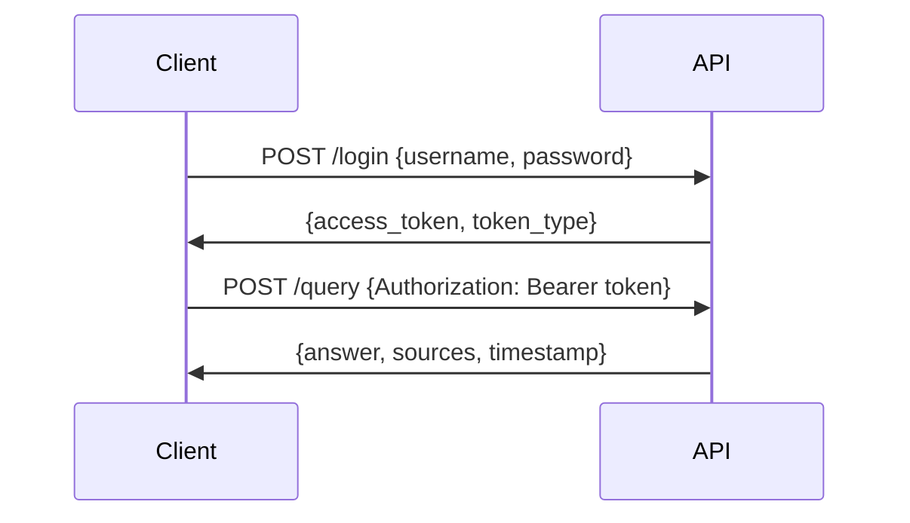

# Universal RAG API System Design Document

**Version 2.0 — 2025-01-04**

A flexible, production-ready Retrieval-Augmented Generation (RAG) API system that can be customized for any domain or use case.

---

## 1. System Overview

The Universal RAG API System is designed to provide intelligent question-answering capabilities for any knowledge domain. By leveraging state-of-the-art RAG technology, it combines the power of vector search with large language models to deliver accurate, contextual responses.

### Core Principles

- **Domain Agnostic**: Works with any type of content or knowledge base
- **Plug-and-Play**: Easy to deploy and customize
- **Production Ready**: Built for scale and reliability
- **Secure by Default**: JWT authentication and configurable access control
- **Extensible**: Modular architecture for easy enhancements

### System Architecture

```text
┌─────────────┐      HTTPS (JSON)      ┌───────────────────────┐
│   Client    │ ─────────────────────▶ │  RAG API (FastAPI)    │
│ Application │                        │  • Auth (JWT)          │
└─────────────┘                        │  • Retriever (FAISS)   │
                                       │  • LLM (OpenAI)        │
                                       └────────┬──────────────┘
                                                │
                      VectorStore.load()        │
                                                ▼
                                        FAISS index (local)
                                                ▲
                                        ingest.py (ETL)
                                                ▲
                                        knowledge/*.md
```

---

## 2. Directory Structure

```
rag-api/
│
├── knowledge/               # Your domain-specific documents
│   ├── document1.md
│   ├── document2.md
│   └── ...
│
├── prompt/                  # Prompt configuration
│   └── prompt.yaml         # Customizable system prompts
│
├── vector_store/           # Generated vector embeddings
│   ├── index.faiss
│   └── index.pkl
│
├── src/                    # Source code
│   ├── ingest.py          # Document processing pipeline
│   ├── server.py          # FastAPI application
│   ├── config.py          # Configuration management
│   ├── query_cli.py       # Command-line interface
│   └── demo_runner.py     # Demo and testing tool
│
├── tests/                  # Test suite
│   ├── test_ingest.py
│   └── test_server.py
│
├── requirements.txt        # Python dependencies
├── .env.example           # Environment variable template
├── Dockerfile             # Container configuration
└── docker-compose.yml     # Multi-container setup
```

---

## 3. Component Architecture

### 3.1 Document Processing Pipeline

| Component | Technology | Configuration | Purpose |
|-----------|-----------|---------------|---------|
| **Document Loader** | Python + Markdown | Supports .md, .txt | Ingests knowledge documents |
| **Text Splitter** | LangChain MarkdownTextSplitter | chunk_size=800, overlap=100 | Creates semantic chunks |
| **Embeddings** | OpenAI text-embedding-3-small | Dimension: 1536 | Generates vector representations |
| **Vector Store** | FAISS | Flat index, L2 distance | Enables similarity search |

### 3.2 Query Processing Pipeline

| Component | Technology | Configuration | Purpose |
|-----------|-----------|---------------|---------|
| **API Gateway** | FastAPI | Async, auto-docs | REST API interface |
| **Authentication** | JWT + python-jose | HS256, 24h expiry | Secure access control |
| **Retriever** | FAISS VectorStore | k=6 neighbors | Finds relevant chunks |
| **LLM Integration** | OpenAI GPT-4 | temperature=0.3 | Generates responses |
| **Prompt Manager** | YAML + Jinja2 | Customizable templates | Domain-specific behavior |

### 3.3 Configuration System

```python
# Environment Variables (.env)
OPENAI_API_KEY=sk-...          # Required: OpenAI API access
JWT_SECRET_KEY=...             # Required: JWT signing key

# Optional Configurations
CHUNK_SIZE=800                 # Document chunk size
CHUNK_OVERLAP=100             # Overlap between chunks
RETRIEVAL_K=6                 # Number of chunks to retrieve
LLM_MODEL=gpt-4              # LLM model selection
LLM_TEMPERATURE=0.3          # Response creativity (0-1)
VECTOR_STORE_PATH=vector_store # Vector store location
KNOWLEDGE_PATH=knowledge      # Knowledge base location
```

---

## 4. API Specification

### 4.1 Authentication Flow



### 4.2 Endpoints

#### Health Check
```http
GET /health
Response: {
  "status": "ok",
  "timestamp": "2025-01-04T10:00:00Z",
  "vector_store_loaded": true,
  "qa_chain_ready": true
}
```

#### Login
```http
POST /login?username={username}&password={password}
Response: {
  "access_token": "eyJhbGc...",
  "token_type": "bearer"
}
```

#### Query
```http
POST /query
Headers: 
  Authorization: Bearer {token}
  Content-Type: application/json
Body: {
  "query": "Your question here",
  "user_id": "optional_user_id"
}
Response: {
  "answer": "The detailed response...",
  "sources": ["document1.md", "document2.md"],
  "timestamp": "2025-01-04T10:00:00Z"
}
```

---

## 5. Customization Guide

### 5.1 Knowledge Base Setup

1. **Document Format**: Use Markdown for rich formatting
   ```markdown
   # Topic Title
   
   ## Section 1
   Content with **emphasis** and `code`.
   
   ## Section 2
   - Bullet points
   - Lists
   ```

2. **Document Organization**: Group related content
   ```
   knowledge/
   ├── category1/
   │   ├── topic1.md
   │   └── topic2.md
   └── category2/
       └── topic3.md
   ```

3. **Metadata**: Use frontmatter for document metadata
   ```markdown
   ---
   title: Document Title
   category: Category Name
   tags: [tag1, tag2]
   ---
   # Content starts here
   ```

### 5.2 Prompt Engineering

Edit `prompt/prompt.yaml`:

```yaml
name: Your Assistant Name
version: "1.0"
description: >
  Detailed description of your AI assistant's purpose and capabilities

# Behavior Configuration
language: "en"              # Primary language
tone: "professional"        # professional, friendly, casual
temperature: 0.3           # 0.1-0.9 (factual to creative)
format_preference: "markdown"

# System Instructions
system_prompt: |
  You are a knowledgeable assistant specializing in {domain}.
  Your responses should be:
  - Accurate and fact-based
  - Well-structured and easy to understand
  - Referenced to source documents when possible

# Response Guidelines
response_guidelines:
  - Always cite sources when available
  - Use bullet points for lists
  - Include code examples when relevant
  - Acknowledge uncertainty when appropriate

# Example Interactions
examples:
  - query: "What is X?"
    response: "X is... [Source: document.md]"
```

### 5.3 Advanced Configurations

#### Vector Store Optimization
```python
# For large knowledge bases (>100MB)
text_splitter = RecursiveCharacterTextSplitter(
    chunk_size=1000,
    chunk_overlap=200,
    separators=["\n\n", "\n", ".", "!", "?", ",", " ", ""]
)

# For technical documentation
text_splitter = MarkdownTextSplitter(
    chunk_size=1500,
    chunk_overlap=300
)
```

#### Multi-Model Support
```python
# config.py
LLM_MODELS = {
    "fast": "gpt-3.5-turbo",
    "accurate": "gpt-4",
    "creative": "gpt-4-turbo"
}

# Select based on query type
model = LLM_MODELS.get(query_type, "gpt-4")
```

---

## 6. Deployment Strategies

### 6.1 Local Development
```bash
python3 -m venv venv
source venv/bin/activate
pip install -r requirements.txt
python3 run_etl.py
python3 server.py
```

### 6.2 Docker Deployment
```dockerfile
FROM python:3.11-slim
WORKDIR /app
COPY requirements.txt .
RUN pip install --no-cache-dir -r requirements.txt
COPY . .
RUN python3 run_etl.py
EXPOSE 8000
CMD ["uvicorn", "server:app", "--host", "0.0.0.0", "--port", "8000"]
```

### 6.3 Kubernetes Deployment
```yaml
apiVersion: apps/v1
kind: Deployment
metadata:
  name: rag-api
spec:
  replicas: 3
  template:
    spec:
      containers:
      - name: rag-api
        image: rag-api:latest
        ports:
        - containerPort: 8000
        env:
        - name: OPENAI_API_KEY
          valueFrom:
            secretKeyRef:
              name: rag-secrets
              key: openai-api-key
```

### 6.4 Cloud Deployment Options

| Platform | Service | Configuration |
|----------|---------|---------------|
| **AWS** | ECS Fargate | Auto-scaling, ALB |
| **GCP** | Cloud Run | Serverless, auto-scale |
| **Azure** | Container Instances | Managed containers |
| **Heroku** | Container Registry | Simple deployment |

---

## 7. Performance Optimization

### 7.1 Caching Strategy
```python
from functools import lru_cache
import redis

# In-memory caching for embeddings
@lru_cache(maxsize=1000)
def get_embedding(text: str):
    return embeddings.embed_query(text)

# Redis for distributed caching
cache = redis.Redis(host='localhost', port=6379)
```

### 7.2 Batch Processing
```python
# Process multiple queries concurrently
async def batch_query(queries: List[str]):
    tasks = [process_query(q) for q in queries]
    return await asyncio.gather(*tasks)
```

### 7.3 Vector Store Scaling

| Knowledge Size | Recommended Solution | Configuration |
|----------------|---------------------|---------------|
| < 1GB | FAISS (local) | Default |
| 1-10GB | FAISS (GPU) | faiss-gpu |
| 10-100GB | Chroma | Persistent, distributed |
| > 100GB | Pinecone/Weaviate | Cloud-native |

---

## 8. Security Best Practices

### 8.1 Authentication & Authorization
- Implement OAuth2 for production
- Use short-lived tokens (15-30 minutes)
- Implement refresh token rotation
- Add role-based access control (RBAC)

### 8.2 API Security
- Rate limiting per user/IP
- Request size limits
- Input sanitization
- SQL injection prevention
- XSS protection

### 8.3 Data Security
- Encrypt sensitive documents
- Implement data retention policies
- Audit logging for compliance
- GDPR/CCPA compliance features

---

## 9. Monitoring & Observability

### 9.1 Metrics to Track
```python
# Application metrics
- Request rate and latency
- Token usage and costs
- Cache hit/miss ratios
- Error rates by endpoint

# Business metrics
- Query topics and frequency
- User engagement patterns
- Knowledge base coverage
- Response quality scores
```

### 9.2 Logging Strategy
```python
import structlog

logger = structlog.get_logger()

# Structured logging
logger.info("query_processed", 
    user_id=user_id,
    query_length=len(query),
    response_time=elapsed,
    chunks_retrieved=len(chunks),
    model_used=model_name
)
```

### 9.3 Alerting Rules
- High error rate (> 1%)
- Slow response time (> 5s)
- Low vector store matches
- API quota warnings

---

## 10. Future Enhancements

### Phase 1: Core Improvements
- [ ] Streaming responses for better UX
- [ ] Multi-language support
- [ ] Document version control
- [ ] A/B testing framework

### Phase 2: Advanced Features
- [ ] Fine-tuned models for specific domains
- [ ] Hybrid search (keyword + semantic)
- [ ] User feedback integration
- [ ] Conversation memory

### Phase 3: Enterprise Features
- [ ] Multi-tenancy support
- [ ] Advanced analytics dashboard
- [ ] Custom model deployment
- [ ] Compliance reporting

---

## 11. Troubleshooting Guide

### Common Issues and Solutions

| Issue | Symptoms | Solution |
|-------|----------|----------|
| Slow responses | >5s latency | Reduce chunk size, use GPT-3.5 |
| Poor answers | Irrelevant responses | Improve prompt, increase retrieval_k |
| High costs | Large API bills | Implement caching, use smaller models |
| Memory errors | OOM crashes | Batch processing, reduce vector dimensions |

### Debug Mode
```python
# Enable verbose logging
LANGCHAIN_VERBOSE=true
LOG_LEVEL=DEBUG

# Test individual components
python3 -c "from ingest import KnowledgeIngester; KnowledgeIngester().test()"
```

---

## 12. Contributing Guidelines

### Development Workflow
1. Fork the repository
2. Create feature branch
3. Write tests first (TDD)
4. Implement features
5. Update documentation
6. Submit pull request

### Code Standards
- Python 3.11+
- Type hints required
- 100% test coverage for new code
- Follow PEP 8
- Document all functions

### Testing Requirements
```bash
# Unit tests
pytest tests/unit/

# Integration tests
pytest tests/integration/

# End-to-end tests
python3 demo_runner.py --test-all
```

---

**Build intelligent AI assistants for any domain with the Universal RAG API System!**